# **National Elf Services**

[View the live site here](http://national-elf-service.herokuapp.com/)

This website was designed to bring the holiday magic to children of, but not limited to, 1 to 12 years of age. It features letter templates to Santa, which can be personalized to the wishes of both the parent and child. The letter gets sent to Santa Clause, and a printable response letter is sent back to the child directly from Santa!

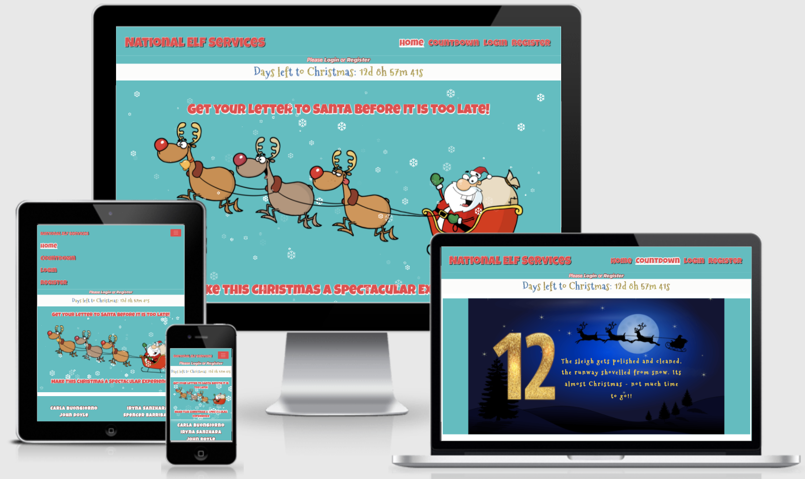

## **Contents**

[User Experience (UX)](#user-experience-ux)
* [User Stories](#user-stories)

[Design](#design)
* [Colour Scheme](#colour-scheme)
* [Typography](#typography)
* [Imagery](#imagery)
* [Wireframes](#wireframes)
* [Features](#features)
* [Future Features](#future-features)

[Information Architecture](#information-architecture)
* [Database Design](#database-design)
* [User Collection](#user-collection)
* [Children Collection](#comic-collection)

[Technologies Used](#technologies-used)
* [Languages Used](#languages-used)
* [Workspace](#workspace)
* [Version Control](#version-control)
* [Wireframing](#wireframing)
* [Responsive Design](#responsive-design)
* [Site Design](#site-design)
* [Database Design Technologies](#database-design-technologies)
* [Frameworks, Libraries and Others](#frameworks-libraries-and-others)
* [Testing](#testing)

[Deployment](#deployment)
* [Requirements for Deployment](#requirements-for-deployment)
* [Initial Deployment](#initial-deployment)
* [How to Fork it](#how-to-fork-it)
* [Making a Local Clone](#making-a-local-clone)

[Testing and Project Barrier Solutions](#testing-and-project-barrier-solutions)

[Credits](#credits)
* [Code](#code)
* [Content](#content)
* [Media](#media)
* [Acknowledgements](#acknowledgements)

---

## **User Experience (UX)**

### User Stories

#### First Time Visitor Goals

As a first time visitor to this site, a user should be able to:

* Easily navigate the site.
* Intuitively and easily understand what to do.
* Register for an account.
* Get visual feedback when an action on the site is completed.

#### Returning Visitor Goals

In addition to the First Time Visitor Goals, a Returning Visitor should be able to:

* Log in.
* Be confident that their password is be stored securely.
* Navigate intuitively, with no need to use the browser's back button.
* Delete their account.
* Send a letter to Santa using a letter template.
* Choose a letter template based on the age of their child.
* Receive a taylored reponse letter from Santa and download it in pdf format.
* See a 12 day update-countdown for how Santa is preparing for Christmas.
* Log out.

[Back to Top](#national-elf-services)

---

## **Design**

### Colour Scheme

* The website uses colours typically related to Christmas.
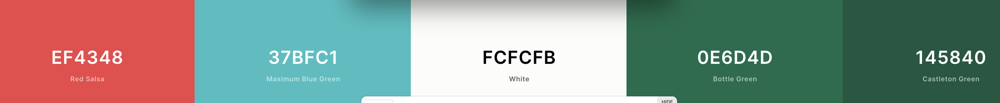

### Typography

* The countdown to Christmas Clock uses a font from [Google Fonts](https://fonts.google.com/?query=Mountains+of+Christmas) called _Mountains of Christmas_. This font creates a playful and exciting feeling for the build up to Christmas. It has a fall back of _cursive_.
* The letters to Santa use a font called _Fuzzy Bubbles_. It has the look and feel of a child's handwriting, and gives the letter's a more 'handwritten' feel. It too has a fall back of _cursive_.
* The navbar links and logo uses a font called _Luckiest Guy_ creating a feeling of friendliness and Christmas Spirit.
* All chosen fonts have a fall back of _cursive_ and were taken from [Google Fonts](https://fonts.google.com/).

### Imagery


### Wireframes

The wireframes for desktop, mobile and tablet for this project can be found [here](docs/wireframes/wireframes.png).

## Features

* Home Page
    * 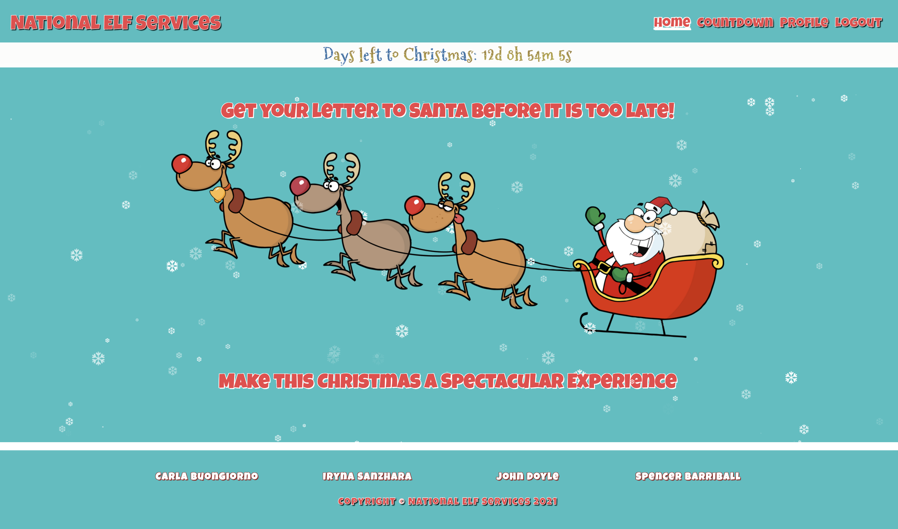

---

* Register
    * 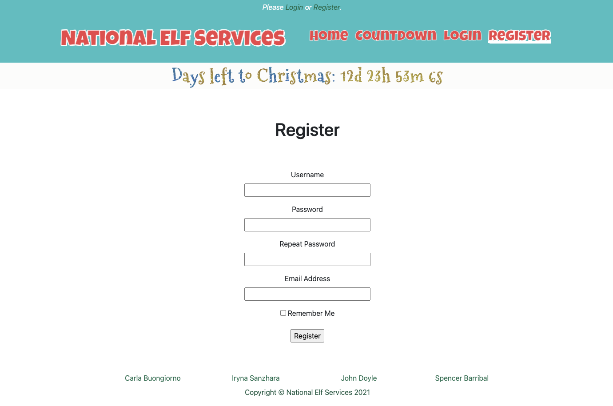

---

* Log In
    * 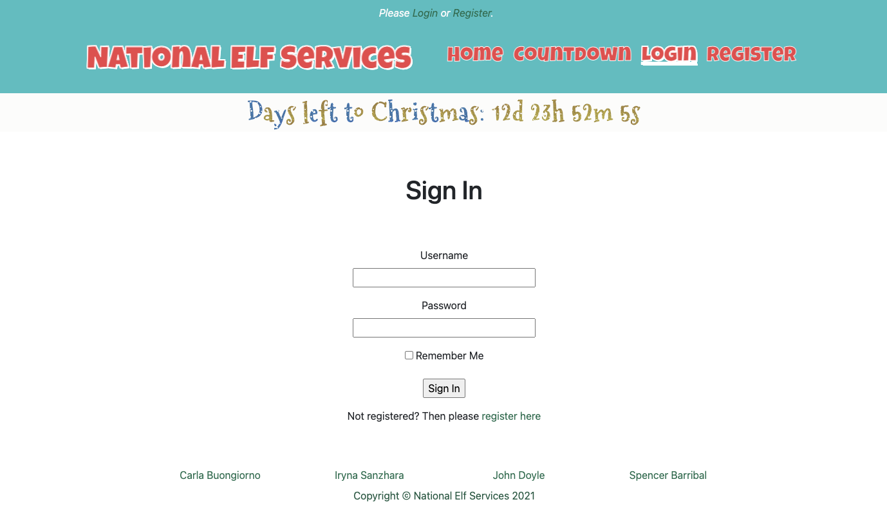

---

* Log Out
    * 

---

* Letter to Santa templates determined by the age of the child.
    * 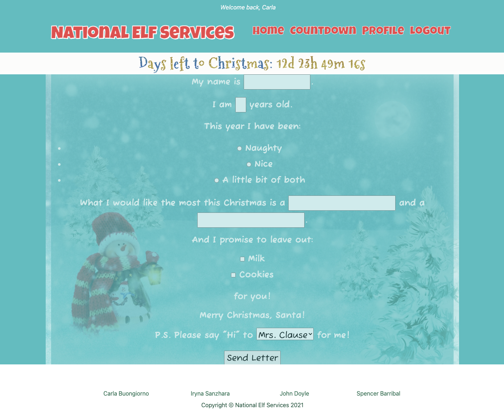
    * 

---

* A letter back from Santa.
    * 

---

* A 12-day update-countdown for how Santa is preparing for Christmas.
    * 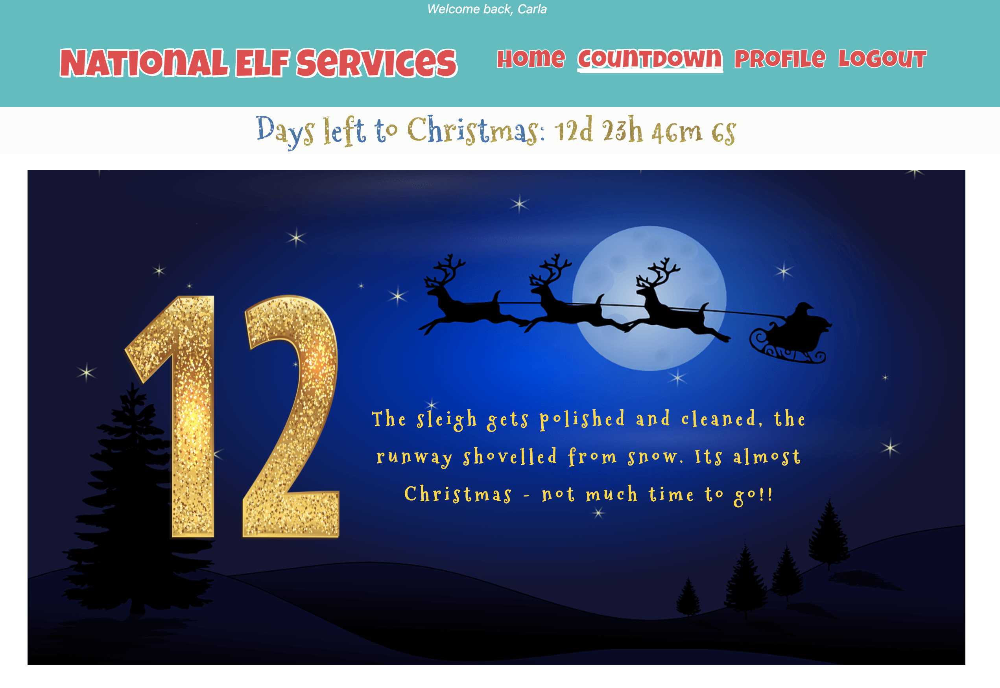
---
#### Process Flowchart

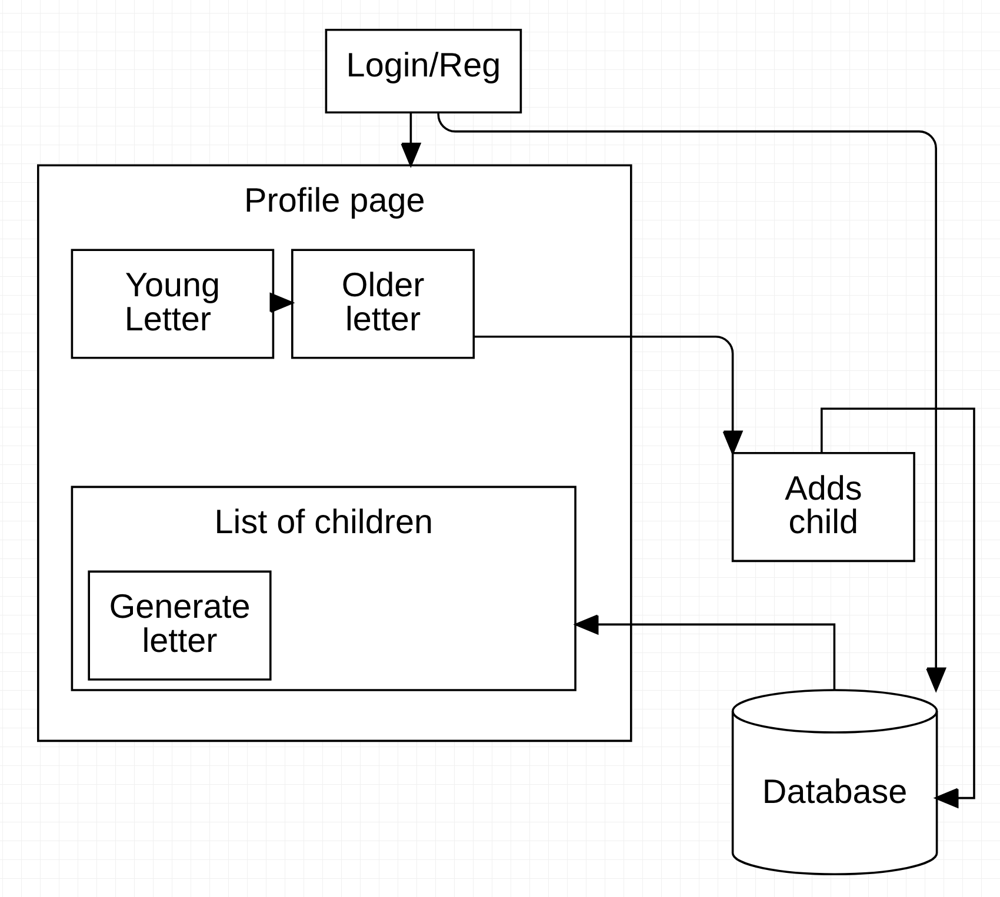

---
### Future Features

* 

[Back to Top](#national-elf-services)

---

## **Information Architecture**

### Navigation bar

The navigation bar changes depending on user status and screen size:

| Nav Link | Logged Out | Logged In (User) | Logged In (Admin) |
|-------|-----|-----|-----|
| Logo (Profile page if logged in, Home Page if not) | &#9989; | &#9989; | &#9989; |
| Log In | &#9989; | &#10060; | &#10060; |
| Register | &#9989; | &#10060; | &#10060; |
| Log Out | &#10060; | &#9989; | &#9989; |
    
* 
* 

### Database Design

MongoDB was used to store data for this site in a database. The data has been set out in two collections, which are described below:

### Users

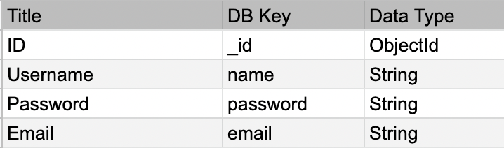

### Children

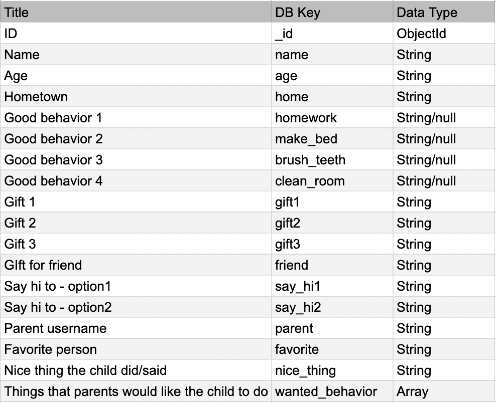

A screenshot of a document from Children's collection

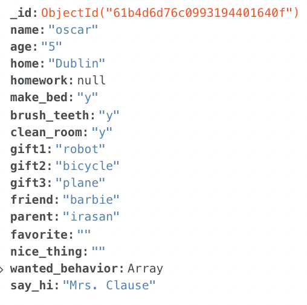

[Back to Top](#national-elf-services)

---

## **Technologies Used**

### Languages Used

* [HTML5](https://developer.mozilla.org/en-US/docs/Web/Guide/HTML/HTML5)
* [CSS3](https://developer.mozilla.org/en-US/docs/Archive/CSS3#:~:text=CSS3%20is%20the%20latest%20evolution,flexible%20box%20or%20grid%20layouts.)
* [JavaScript](https://developer.mozilla.org/en-US/docs/Web/JavaScript)
* [Python](https://www.python.org/)

### Workspace

* [Gitpod](https://gitpod.io/) was used as a virtual IDE workspace to build this site.

### Version Control

* [Git](https://git-scm.com/) was used for version control by utilizing the Gitpod terminal to add and commit to Git and push to GitHub.
* [GitHub](https://github.com/) is used to store the code for this project after being pushed from Git.

### Wireframing

* [Balsamiq](https://balsamiq.com/) was used to create the wireframes during the design process.

### Responsive Design

* [Am I Responsive Design](http://ami.responsivedesign.is/)

### Site Design

* [Font Awesome](https://fontawesome.com/) was used on all pages to add the icons.
* [Coolers.co](https://coolors.co) was used to generate the colour palette in the readme.
* [Google Fonts](https://fonts.google.com/) was used to import the 3 fonts used within the site.
* [Favicon.io](https://favicon.io/emoji-favicons/snowman) was used to generate the snowman favicon for the site.

### Database Design Technologies

* [MongoDB](https://www.mongodb.com/) was used to store the contents of the database, and allow full CRUD functionality.
* [Flask-PyMongo](https://flask-pymongo.readthedocs.io/en/latest/) was used to connect this Python / Flask app to MongoDB.

### Frameworks, Libraries and Others

* [Heroku](https://www.heroku.com) was used to deploy the live site.
* [Google DevTools](https://developer.chrome.com/docs/devtools/) was used to check site responsiveness, and as a general debugger.
* [Lighthouse](https://developers.google.com/web/tools/lighthouse/) was used to check the site's Performance, Accessibility, Best Practices, and SEO.
* [Flask](https://flask.palletsprojects.com/en/2.0.x/) was used to help create the templating for this site.
* [Bootstrap](https://getbootstrap.com/) was used to create a beautiful, responsive website.
* [jQuery](https://jquery.com/) was used to make the DOM traversal easier within the JavaScript.
* [Jinja](https://jinja.palletsprojects.com/en/3.0.x/) was used to auto-populate the site with the contents of the database.
* [RandomKeygen](https://randomkeygen.com/) was used to generate a strong `SECRET_KEY`.
* [pip](https://pip.pypa.io/en/stable/) was used to install the required dependancies for this site.
* [dnspython](https://pypi.org/project/dnspython/) was used to provide access to DNS.

### Testing

* [W3C Markup Validation Service](https://validator.w3.org/) was used to test that the HTML is valid.
* [W3C CSS Validation Service](http://jigsaw.w3.org/css-validator/) was used to test that the CSS is valid.
* [JSHint](https://jshint.com/) was used to test that the JavaScript is valid.
* [PEP8](http://pep8online.com/) was used to validate the python syntax.

[Back to Top](#national-elf-services)

---

## **Deployment**

### Requirements for Deployment

* Python
* MongoDB account and database
* GitHub account
* Heroku account

### Initial Deployment

* MONGO_DBNAME - This is the name of the database you need to connect to in MongoDB.

* MONGO_URI - This can be found on the MongoDB website by following these steps:
    * In the clusters tab of your database, click connect on the associated cluster.
    * Click 'Connect', then 'Connect your application'.
    * Copy the string, then substitute the password (from Database access NOT your MongoDB password) and change "myFirstDB" to your MONGO_DBNAME.

* SECRET_KEY - This is a custom string set up to keep sessions secure. I recommend using a 'Fork Knox' level password generated by [RandomKeygen](https://randomkeygen.com/).

* This site was deployed to Heroku by following these steps:

    1. Heroku needs to be told what the requirements are for this project, so go into your GitPod terminal, and create files to explain the requirements by using the following commands:
        * `pip3 freeze --local > requirements.txt`
        * `echo web: python run.py > Procfile` - Ensure there is no blank line after the contents of this file
    2. Push these changes to your repository.
    3. Ensure you have a .gitignore file in your repository, and if not, create one.
    4. Add `env.py` and `__pycache__/` into your .gitignore file, and save the file. This is to avoid any sensitive information being added into your repository.
    5. Create an env.py file, and add the following information to it, updating the '## x ##' values with your own values:

        ``` python
        import os

        os.environ.setdefault("IP", "0.0.0.0")
        os.environ.setdefault("PORT", "5000")
        os.environ.setdefault("SECRET_KEY", " ## YOUR SECRET_KEY ## ")
        os.environ.setdefault("MONGO_URI", " ## YOUR MONGO_URI ## ")
        os.environ.setdefault("MONGO_DB", " ## YOUR MONGO_DBNAME ## ")
        ```

    6. Login or sign up to [Heroku](https://www.heroku.com).
    7. Select 'Create New App' in the top right of your dashboard.
    8. Choose a unique app name, and select the region closest to you, before clicking 'Create App'.
    9. Go to the 'Deploy' tab, find 'Deployment Method' and select 'GitHub'.
    10. Search to find your GitHub repository, and click 'Connect'. Don't enable automatic deployment yet, as this can cause errors.
    11. Go to the 'Settings' tab, find 'Config Vars', and click 'Reveal Config Vars'.
    12. Enter key value pairs that match those in your env.py file, displayed like this :

        | Key | Value |
        |---|---|
        | IP | 0.0.0.0 |
        | PORT | 5000 |
        | MONGO_DBNAME | ## YOUR DATABASE NAME ## |
        | MONGO_URI | ## YOUR MONGO_URI ## |
        | SECRET_KEY | ## YOUR SECRET_KEY ## |

    13. Go to the 'Deploy' tab, and click 'Enable Automatic Deployment'.
    14. In 'Manual Deploy', choose which branch you'd like to deploy from (I chose 'master' branch, this is also known as 'main').
    15. Click 'Deploy Branch' to deploy your app onto the Heroku servers.
    16. Once the app has finished building, click 'Open App' to open your site.

### How to Fork it

1. Login or Sign Up to [GitHub](www.github.com).
2. On GitHub, go to [irasan/christmas-hackathon2021](https://github.com/irasan/christmas-hackathon2021/pull/4).
3. In the top right, click "Fork".
4. You will need to create an env.py file with your own values, and create a MongoDB database with the data keys and types as shown above.
5. You will also need to install all of the project requirements. This can be done using the command:
    * `pip3 install -r requirements.txt`
6. Type `python3 app.py` in your GitPod terminal to run your local site of this project.

### Making a Local Clone

1. Log in to [GitHub](https://www.github.com) and locate the [Repository](https://github.com/irasan/christmas-hackathon2021/pull/4) for this site.
2. Under the repository name, above the list of files, click "Code".
3. Here you can either Clone or Download the repository.
4. You should clone the repository using HTTPS, clicking on the icon to copy the link.
5. Open Git Bash.
6. Change the current working directory to the new location, where you want the cloned directory to be.
7. Type `git clone`, and then paste the URL that was copied in Step 4.
    * `git clone https://github.com/irasan/christmas-hackathon2021/pull/4.git`
8. Press Enter, and your local clone will be created.
9. You will need to create an env.py file with your own values, and create a MongoDB database with the data keys and types as shown above.
10. You will also need to install all of the project requirements. This can be done using the command:
    * `pip3 install -r requirements.txt`.
11. Type `python3 app.py` in your Gitpod terminal to run your local site of this project.

Alternatively, if using Gitpod, you can click below to create your own workspace using this repository.

[](https://github.com/irasan/christmas-hackathon2021/pull/4)

[Back to Top](#national-elf-services)

---

## **Testing And Project Barrier Solutions**

All testing and project barriers and solutions has been documented here - [TESTING.md](https://github.com/irasan/christmas-hackathon2021/pull/4/TESTING.md)

[Back to Top](#national-elf-services)

---

## **Credits**

### Code

* [Code Institute](https://codeinstitute.net/) was the main source of information used to create this project.
* [Bootstrap](https://getbootstrap.com/): Throughout the site, to create a beautiful responsive site.

### Media

* [Pixabay](https://pixabay.com/illustrations/christmas-motif-christmas-card-3774320/)
* [Pixabay](https://pixabay.com/illustrations/christmas-motif-christmas-card-3794751/)

#### Countdown Backgrounds

* [Pixabay](https://pixabay.com/vectors/moon-silhouettes-santa-claus-31665/)

#### Countdown Numbers

* [Yo Priceville Gallery](https://gallery.yopriceville.com/Free-Clipart-Pictures/Decorative-Numbers/Number_One_Gold_Shining_PNG_Clip_Art_Image#.YbY21_HMLPZ) Number 1
* [Yo Priceville Gallery](https://gallery.yopriceville.com/Free-Clipart-Pictures/Decorative-Numbers/Number_Two_Gold_Shining_PNG_Clip_Art_Image#.YbZHEPHMLPY) Number 2
* [Yo Priceville Gallery](https://gallery.yopriceville.com/Free-Clipart-Pictures/Decorative-Numbers/Number_Three_Gold_Shining_PNG_Clip_Art_Image#.YbZHIPHMLPY) Number 3
* [Yo Priceville Gallery](https://gallery.yopriceville.com/Free-Clipart-Pictures/Decorative-Numbers/Number_Four_Gold_Shining_PNG_Clip_Art_Image#.YbZHLPHMLPY) Number 4
* [Yo Priceville Gallery](https://gallery.yopriceville.com/Free-Clipart-Pictures/Decorative-Numbers/Number_Five_Gold_Shining_PNG_Clip_Art_Image#.YbZHN_HMLPY) Number 5
* [Yo Priceville Gallery](https://gallery.yopriceville.com/Free-Clipart-Pictures/Decorative-Numbers/Number_Six_Gold_Shining_PNG_Clip_Art_Image#.YbZHQ_HMLPY) Number 6
* [Yo Priceville Gallery](https://gallery.yopriceville.com/Free-Clipart-Pictures/Decorative-Numbers/Number_Seven_Gold_Shining_PNG_Clip_Art_Image#.YbZHTvHMLPY) Number 7
* [Yo Priceville Gallery](https://gallery.yopriceville.com/Free-Clipart-Pictures/Decorative-Numbers/Number_Eight_Gold_Shining_PNG_Clip_Art_Image#.YbZHW_HMLPY) Number 8
* [Yo Priceville Gallery](https://gallery.yopriceville.com/Free-Clipart-Pictures/Decorative-Numbers/Number_Nine_Gold_Shining_PNG_Clip_Art_Image#.YbZHZ_HMLPY) Number 9
* [PikPng](https://www.pikpng.com/downpngs/owwbRR_hourglass-clipart-gold-golden-sand-clock-png-download/) Hourglass


### Acknowledgements

* 

[Back to Top](#national-elf-services)